# Desert Space Light

A warm, light theme for Visual Studio Code inspired by the Japandi design style and desert planets from imaginary universes.

Anyone who knows me professionally knows I've been struggling with the switch from JetBrains IDEs to VS Code. After 10 years in IntelliJ and WebStorm, certain patterns are just burned into my muscle memory and visual expectations. It's not a complete switch (some things I still do better in JetBrains IDEs), but VS Code has its strengths and I wanted it to feel more like home. So I started from the IntelliJ light theme and built on top of it.

The color palette is inspired by the desert planets of the fictional universes, such as Tatooine from Star Wars and Arrakis from the Dune books and the new movies (the old one aged like milk). Generally, I find Star Wars Mandalorian series aesthetic quite appealing and meditative. I drew a lot of inspiration from Beskar armor, terracotta dunes, Grogu's sage-green robes, the amber eyes of Jawas... Turns out all of that makes for a great light theme. A lot of elements are bright, warm and use a narrow range of earth tones with just enough contrast to keep things readable. The overall aesthetic leans Japandi, that Japanese-Scandinavian blend of clean lines, warm neutrals and functional minimalism where nothing is there unless it earns its place.

## Design Principles

I started from IntelliJ IDEA's New UI light theme. To me it's one of the most well-balanced light themes out there. I didn't want to reinvent the structural hierarchy, just shift the entire temperature from cool blue-gray to warm desert sand.

**Warm over cool.** I find that cool grays tire my eyes over long sessions. Warm neutrals feel more natural to me and recede more comfortably, so every background, border and surface here uses warm undertones.

**Meaning through scarcity.** I kept it to six color families in syntax highlighting, each with a clear semantic role. I've always felt that when everything is colorful, nothing stands out, but when color is rare, it carries weight.

**Contrast where it counts.**  Keywords, variables and strings are not the most high-contrast, but should be easy enough to read. Comments and lighter accents are intentionally softer. I wanted them to stay out of my way. I chose warmth and readability over strict accessibility compliance.

## Color Philosophy

The palette draws from desert landscapes, weathered metal, terracotta clay, and the greens of sparse desert vegetation. Each color family maps to a specific role in both the UI chrome and syntax highlighting.

### Sand / Background Tones

The foundation layer. These warm parchment tones replace the typical blue-gray backgrounds found in most light themes. The subtle warmth reduces perceived harshness without sacrificing readability.

|                                                                      | Name             | Hex       | Usage                                    |
|----------------------------------------------------------------------|------------------|-----------|------------------------------------------|
|  | Desert sand base | `#FAF6F0` | Editor background as warm parchment white |
|  | Panel sand       | `#F5EFE6` | Sidebars, panels, inactive tabs          |
|  | Border dune      | `#E8DFD1` | All borders and dividers                 |
| 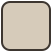 | Deep sand        | `#D6CBBA` | Scroll tracks, deeper UI elements        |

### Ancestral Silver Metal

The structural mid-tones. These warm silver-browns handle all the "infrastructure" text (line numbers, operators, punctuation), the things you need to see but shouldn't compete with your actual code.

|                                                                      | Name                  | Hex       | Usage                                       |
|----------------------------------------------------------------------|-----------------------|-----------|---------------------------------------------|
| 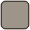 | Silver metal muted    | `#9E958A` | Inactive text, inlay hints                  |
| 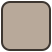 | Silver metal mid      | `#B8A99A` | Line numbers, focus borders                 |
| 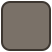 | Silver metal polished | `#7A7168` | Active line numbers, operators, punctuation |
| 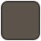 | Silver metal dark     | `#5C544B` | Secondary foreground, diff text             |

### Space Traveller's Armor / Title Bar

The dark chrome tones anchor the top of the editor. The title bar uses deep warm darks that ground the interface, while the gold accent in the command center provides a distinctive focal point.

|                                                                      | Name         | Hex       | Usage                              |
|----------------------------------------------------------------------|--------------|-----------|------------------------------------|
| 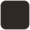 | Helmet visor | `#2E2923` | Title bar, primary foreground text |
|  | Armor plate  | `#3D3630` | Title bar inactive state           |
| 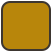 | Command gold | `#B8860B` | Command center accent              |

### Accent: The Child Green

The primary accent color. Used for active states, selections, and, crucially, string literals in syntax highlighting. Green signals "living data" in code: the values your program works with at runtime. This sage-to-forest range also handles git additions and documentation comments.

|                                                                      | Name            | Hex       | Usage                                                     |
|----------------------------------------------------------------------|-----------------|-----------------------------------------------------------|------------------------------------------------------------|
| 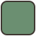 | The Child sage  | `#6B8F71` | Active tab border, activity bar indicator, primary accent |
| 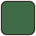 | The Child deep  | `#3E6B45` | Strings, git added files, doc comments                    |
| 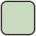 | The Child light | `#C8DBBE` | Active selections, list active background                 |
| 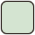 | The Child pale  | `#D4E4D1` | Word highlights, find match, markup insertions            |

### Accent: Desert Terracotta

The warm highlight tone. Terracotta marks immutable values in your code (numbers, constants, character entities). Things that are fixed, like rock formations. Also used for CSS property names and markup headings, where a warm pop helps with scannability.

|                                                                      | Name            | Hex       | Usage                                            |
|----------------------------------------------------------------------|-----------------|-----------|--------------------------------------------------|
| 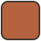 | Terracotta      | `#B5623F` | Numbers, constants, CSS property names, headings |
|  | Terracotta glow | `#FCEBD5` | Find match highlight background                  |

### Accent: Desert Planet Sky

The cool counterpoint. Every warm palette needs a touch of blue to prevent monotony and provide a visual "rest". These twilight tones handle elements that reference or point to other things such as links, HTML attributes, git modifications, regex patterns, etc.

|                                                                      | Name      | Hex       | Usage                               |
|----------------------------------------------------------------------|-----------|-----------|-------------------------------------|
| 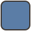 | Dusk blue | `#5B7DA6` | Links, regex, markup lists          |
| 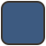 | Twilight  | `#3D5A80` | HTML attributes, git modified files |

### Accent: Desert Scavenger Amber

A golden amber used sparingly for high-visibility moments, the active find match and CSS selectors. This is the "notice me" color, used only where the user's attention needs to snap to a specific location.

|                                                                      | Name                  | Hex       | Usage                                           |
|----------------------------------------------------------------------|-----------------------|-----------|-------------------------------------------------|
| 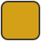 | Desert scavenger eyes | `#D4A017` | Active find match                               |
| 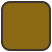 | Sand creature pearl   | `#8B6914` | CSS selectors, markup quotes, JS function names |

### Syntax: Dark Earth Tones

The core syntax palette. These are the colors that do the real work of making code readable. Each maps to a specific grammatical role.

|                                                                      | Name                  | Hex       | Role                                        | Why this color                                                     |
|----------------------------------------------------------------------|-----------------------|-----------|---------------------------------------------|--------------------------------------------------------------------|
| 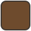 | Companion mount brown | `#6E4B2D` | Keywords (`const`, `if`, `class`, `import`) | Bold and grounded so that keywords define your code's structure          |
| 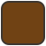 | Robe brown            | `#704214` | Variables, instance properties               | Slightly warmer for the things that change and carry state           |
| 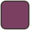 | Ancient beast         | `#7B3F61` | Functions, object keys                       | A dusky purple-brown for the verbs of your code, distinct from nouns |
| 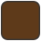 | Sand creature         | `#5E3A1A` | Exceptions, errors                           | Deep and dark for the elements that draw appropriate attention to danger              |
| 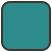 | Oasis teal            | `#2E8B8B` | Object references (JS)                       | A rare cool tone that marks the objects you're reaching into          |

## Token-to-Color Quick Reference

For theme developers who want to understand or modify the syntax mapping:

| What you're reading | Color | Hex |
|---------------------|-------|-----|
| Comments | Faded sand (italic) | `#B0A898` |
| Doc comments | The Child sage | `#6B8F71` |
| Keywords & storage | Companion mount brown (bold) | `#6E4B2D` |
| Strings | The Child deep (bold) | `#3E6B45` |
| Numbers & constants | Terracotta | `#B5623F` |
| Variables | Robe brown (bold) | `#704214` |
| Functions | Ancient beast | `#7B3F61` |
| Operators & punctuation | Silver metal polished | `#7A7168` |
| HTML tags | Companion mount brown (bold) | `#6E4B2D` |
| HTML attributes | Twilight | `#3D5A80` |
| CSS selectors | Sand creature pearl | `#8B6914` |
| CSS properties | Terracotta | `#B5623F` |
| CSS values | The Child deep | `#3E6B45` |
| Regex | Dusk blue | `#5B7DA6` |
| Invalid/illegal | Sand creature on warning bg | `#C0503A` |

## Installation

### From VS Code Marketplace

1. Open the **Extensions** view (`Ctrl+Shift+X` / `Cmd+Shift+X`)
2. Search for **Desert Space Light**
3. Click **Install**
4. Open **Preferences: Color Theme** (`Ctrl+K Ctrl+T` / `Cmd+K Cmd+T`)
5. Choose **Desert Space Light**

### Recommended settings

These editor settings complement the theme well:

```json
{
  "editor.fontFamily": "'JetBrains Mono', 'Fira Code', 'Cascadia Code', monospace",
  "editor.fontSize": 14,
  "editor.lineHeight": 1.7,
  "editor.bracketPairColorization.enabled": false,
  "editor.renderLineHighlight": "all",
  "editor.cursorBlinking": "smooth",
  "workbench.tree.indent": 16
}
```

Bracket pair colorization is disabled by recommendation. The theme's restrained palette clashes with the rainbow brackets. If you prefer them, the warm tones of the theme will still work, but the minimalist intent is best preserved without them.

## Customization

To override specific colors without forking the theme, add to your `settings.json`:

```json
{
  "workbench.colorCustomizations": {
    "[Desert Space Light]": {
      "editor.background": "#FBF7F2"
    }
  },
  "editor.tokenColorCustomizations": {
    "[Desert Space Light]": {
      "comments": "#C0B8A8"
    }
  }
}
```

## Acknowledgements

Built on the structural foundation of the [IntelliJ IDEA New UI](https://www.jetbrains.com/help/idea/new-ui.html) light theme. The color mapping, palette design and semantic associations are original.

## License

MIT